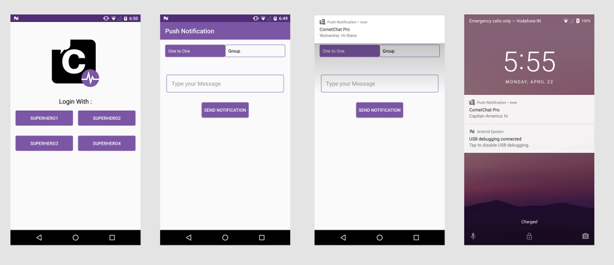

	

		

			
		
	
	
	

 
 

      

## Table of Contents

1. [Screenshots ](#screenshots)

2. [Installation ](#installtion)

3. [Run the Sample App ](#run-the-sample-app)

4. [Contribute](#contribute)

## ScreenShots

 
 
 
 
 
 
 
 
 
 
 
 
## Installtion

   Simply Clone the project from android-java-push-notifications-app repository and open in Android Studio.
   Build the Demo App and it will be ready to Run

 ## Note

      Branch v1.8 contains UI with SDK v1.8+ .

      Branch v2.0 contains UI with SDK v2.0+ . Apps created in v2 requires Region. Branch v2 and master contains CometChat Pro    SDK with latest feature and updates

## Run the Sample App

   To Run to sample App you have to do the following changes by Adding **ApiKey** and **AppId**

   - Go to Under java ` -->com\inscripts\cometchatpro-->Constant`

   - Under class `Constant.java`

   -  modify *APP_ID* and *API_KEY* with your own **ApiKey** and **AppId**

       `static final String API_KEY= "XXXXXXXXXXXXXX";`

       `static final String APP_ID = "XXXXXXXXXXXXXX";`

       `val REGION: String = "us"`

                us = USA (if your app region is USA).

                eu = EUROPE (if your app region is EUROPE).

          Find out more with the new Dashboard.[CometChat-Pro Dashboard](https://app.cometchat.io/)
       
   - modify *FCM_APPLICATION_ID* and *FCM_WEB_API_KEY* wtih your `WEB_API_KEY` and `APPLICATION_ID`
     from your firebase console

      you can get your Web API Key and App Id from your firebase console under -->Project Settings-->General

         `static final String FCM_APPLICATION_ID="XXXXXXXXXXXXX";`

         `static final String FCM_WEB_API_KEY="XXXXXXXXXXXXXX";`

   - `static final String UID` is UID of receiver

   - `static final String GUID` is GUID of joined group

   - To enable push notifcation follow the instruction here [How to Add Push Notification in Cometchat Pro](https://prodocs.cometchat.com/docs/extensions-android-push-notifications)

## Note

   You can Obtain your  *APP_ID* and *API_KEY* from [CometChat-Pro Dashboard](https://app.cometchat.com/)

   For more information read [CometChat-Pro Android SDK](https://prodocs.cometchat.com/docs/android-quick-start)
   Documentation

   You can Obtain fiyour  *FCM_APPLICATION_ID* and *FCM_WEB_API_KEY* from [Firebase Console](https://console.firebase.google.com/)

## Contribute

 Feel free to make Pull Request.
   
