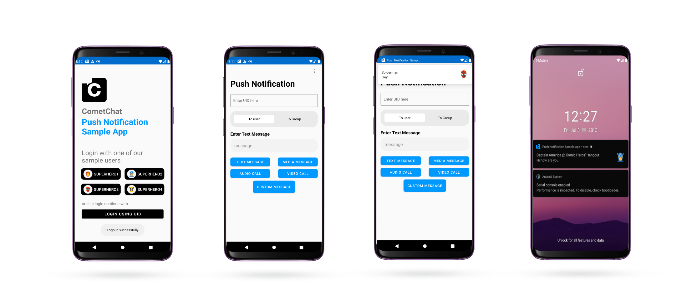

CometChat Push Notification Sample App is a fully functional push notification app capable of one-on-one (private) and group messaging as well as Calling. This sample app enables users to send and receive push notifications for text and multimedia messages like **images, videos, documents as well as  Custom Messages** . Also, users can make push notifications for Audio and Video calls to other users or groups.

      

## Table of Contents

1. [Screenshots ](#screenshots)

2. [Installation ](#installtion)

3. [Run the Sample App ](#run-the-sample-app)

4. [Contribute](#contribute)

## Screenshots

 
 
 
 
 
 
 
 
 
 
## Installation

   Simply Clone the project from android-java-push-notifications-app repository and open in Android Studio.
   Build the Demo App and it will be ready to Run

## Run the Sample App

To Run to sample app you have to do the following changes by Adding **APP_ID**, **API_KEY** , **REGION** and **google-services.json**

   You can obtain your  *APP_ID*, *API_KEY* and *REGION* from [CometChat-Pro Dashboard](https://app.cometchat.io/)

   You can Obtain your  *google-services.json* from [Firebase Console](https://console.firebase.google.com/)

   - Open the project in Android Studio.

   - Modify `APP_ID` and `API_KEY` and `REGION` with your own .
   
   - Add `google-services.json` in **app** directory

   - Select demo users or enter the **UID** at the time of login once the app is launched.

Build and run the Sample App.
       

## Note

   To enable push notifcation follow the instruction here [How to Add Push Notification in Cometchat Pro](https://prodocs.cometchat.com/docs/android-extensions-push-notification)
  
   You can Obtain your  *APP_ID* and *API_KEY* from [CometChat-Pro Dashboard](https://app.cometchat.com/)

   For more information read [CometChat-Pro Android SDK](https://prodocs.cometchat.com/docs/android-quick-start)
   Documentation

   You can Obtain your  *google-services.json* from [Firebase Console](https://console.firebase.google.com/)

## Contribute

 Feel free to make Pull Request.
  
